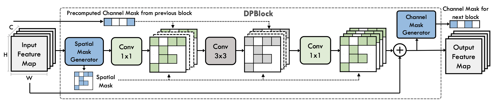
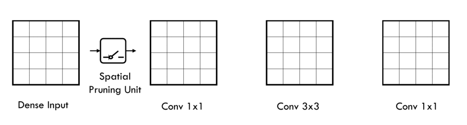

# DPACS: Hardware Accelerated Dynamic Neural Network Pruning through Algorithm-Architecture Co-design

This repository contains the implementation for 

> **DPACS: Hardware Accelerated Dynamic Neural Network Pruning through Algorithm-Architecture Co-design**  
> Yizhao Gao, Baoheng Zhang, Xiaojuan Qi, Hayden So  
> (ASPLOP 2023) 

DPCAS is an algorithm-architecture co-design framework for dynamic neural network pruning. It utilizes a hardware-aware dynamic spatial and channel pruning mechanism in conjunction with a dynamic dataflow engine in hardware to facilitate efficient processing of the pruned network. 

Example pruning diagram of DPCAS:
<p align="center">
    
</p>

Elastic sparse dataflow for dynamic spatial pruning: 
<p align="center">
    
</p>


## Outlines
* `./hardware`: Hardware source code, bitstreams, driver of the DPACS accelerator
* `./software`: Python source code, scripts, model checkpoints and training logs DPACS alrgoithm

## Dependencies
The dependancies of the hardware and software experiments are specified in `./hardware/README.md` and `./software/README.md` respectively.


## Citation
If you find this work useful for your research, please cite our paper:
```
@inproceedings{10.1145/3575693.3575728,
    author = {Gao, Yizhao and Zhang, Baoheng and Qi, Xiaojuan and So, Hayden Kwok-Hay},
    title = {DPACS: Hardware Accelerated Dynamic Neural Network Pruning through Algorithm-Architecture Co-Design},
    year = {2023},
    publisher = {Association for Computing Machinery},
    address = {New York, NY, USA},
    url = {https://doi.org/10.1145/3575693.3575728},
    doi = {10.1145/3575693.3575728},
    booktitle = {Proceedings of the 28th ACM International Conference on Architectural Support for Programming Languages and Operating Systems, Volume 2},
    pages = {237–251},
    numpages = {15},
    series = {ASPLOS 2023}
}

