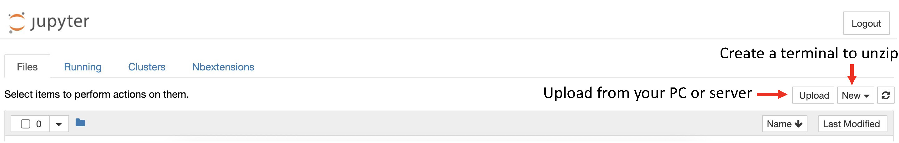

## ZCU 102 drive of the design

This folder contains the python scripts and jupyter notebook to run the accelerator on the ZCU102 board. It's based on PYNQ overlay framework. 

If you regenerate all the bitstream files, the bitstream wil be placed in the ./bitfile folder. 

To run the test, zip the entire folder and upload to the board using the jupyter server.
```
    tar -cvzf ZCU102.tar.gz ./ZCU102
```
If you have GUI running on your machine to synthesis the bitstream files and it can also access your FPGA board, you can directly upload the files to the board. Otherwise, you might need to first prepare the files and copied to whatever PC/server that can connect to the FPGA board. Then upload using the jupyter server powered by PYNQ.




More about PYNQ see [here](https://pynq.readthedocs.io/en/v2.6.1/).