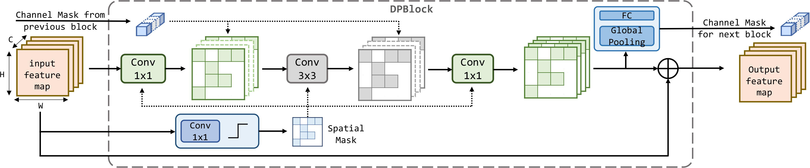

# DPACS Software: Pruning Algorithms




### Requirements

The codes are tested on Ubuntu 18.04 with CUDA 10.2
```shell script
# Create environment
conda create -n DPACS python=3.6
conda activate DPACS

# Install PyTorch & Torchvision
pip install torch==1.6.0 torchvision==0.7.0
# Install other requirements
pip install -r scripts/requirements.txt
```

Or just simply using the following scripts

```shell script
sh scripts/install.sh
```

### Dataset
For **cifar10**, the dataset will be automatically downloaded when training or evaluating.  
For **Imagenet**, you should register and download the [dataset](https://www.image-net.org/). The files will be organized as:
```text
imagenet
├── train
├── valiation
├── test
├── ILSVRC2012_devkit_t12
```

### Checkpoints
Our trained models can be found here: [One drive](https://connecthkuhk-my.sharepoint.com/:f:/g/personal/bhzhang_connect_hku_hk/Et7ZFzekdZhFlx5RoLeJyJEBVHFm2AWvVS3fbmL4RaX8TA?e=rnDcNT). 
Unzip and place them into the main folder.

After unzipping the checkpoints, the file structure should be 
```text
software
├── config
├── dataloader
├── DPACS_checkpoint
├──── baseline
├──── cifar10_resnet32_BN
├──── imagenet_basicBlock_inputMask
├──── imagenet_mobilenet
├──── imagenet_resnet50_BlockMask
├──── imagenet_resnet50_ResolutionMask
├──── imagenet_resnet101
├── models
├── utils
├── main_cifar.py
├── main_imagenet.py
...
```

### Evaluate trained DPACS checkpoints:

You can use the following command to evaluate a single checkpoint:

```shell script
# imagenet
python main_imagenet.py --model [ARCH] --dataset-root [PATH-TO-IMAGENET] --load [PATH_TO_CHECKPOINTS] --budget [BUDGET] --channel_budget [CHANNEL_BUDGET] --channel_stage [CHANNLE_STAGE] -e --group_size [CHANNEL_GROUP_SIZE] --pooling_method [POOLING_METHOD] --batchsize [BATCH_SIZE]

# Example
python main_imagenet.py --model resnet50 --resolution_mask --model_cfg hardware_2048 --batchsize 72 --pooling_method ave --budget 0.75  --group_size 64 --channel_budget 0.75 --channel_stage 2 3 --load /media/hkuit164/Elements1/DPACS_checkpoint/imagenet_resnet50_ResolutionMask/s75_c75.pth -e --dataset-root [PATH-TO-IMAGENET]
```

To evaluate all the trained checkpoints:
```shell script
sh scripts/evaluate_imagenet.sh [PATH-TO-IMAGENET] [BATCH-SIZE]
sh scripts/evaluate_cifar10.sh [BATCH-SIZE]
```

### Train DPACS models

Our training logs can be found [here](https://connecthkuhk-my.sharepoint.com/personal/bhzhang_connect_hku_hk/_layouts/15/onedrive.aspx?id=%2Fpersonal%2Fbhzhang%5Fconnect%5Fhku%5Fhk%2FDocuments%2FDPACS%5Flog&ga=1)

Imagenet
```shell script
# Imagenet baseline
python main_imagenet.py --model [ARCH] --dataset-root [PATH-TO-DATASET] --budget -1 --batchsize [BATCH_SIZE]

# Imagenet DPACS
python main_imagenet.py --model [ARCH] --dataset-root [PATH-TO-DATASET] --load [PATH_TO_CHECKPOINTS] --budget [BUDGET] --channel_budget [CHANNEL_BUDGET] --channel_stage [CHANNLE_STAGE] -e --group_size [CHANNEL_GROUP_SIZE] --pooling_method [POOLING_METHOD] --batchsize [BATCH_SIZE]

# Example
python main_imagenet.py --model resnet50 --dataset-root [PATH-TO-DATASET] --budget -1 --batchsize 32  -s exp/imagenet_baseline
python main_imagenet.py --model resnet50 --dataset-root [PATH-TO-DATASET] --budget 0.5 --channel_budget 0.5 -s exp/imagenet_sparse --channel_stage 2 3 --group_size 64 --pooling_method ave --batchsize 32

```

CIFAR10
```shell script
# Cifar10 baseline
python main_cifar.py --model [ARCH] --budget -1 --batchsize [BATCH_SIZE] -s [SAVE_DIR]

# Cifar10 DPACS
python main_cifar.py --model [ARCH] --load [PATH_TO_CHECKPOINTS] --budget [BUDGET] -s [SAVE_DIR] --channel_budget [CHANNEL_BUDGET] --channel_stage [CHANNLE_STAGE] -e --group_size [CHANNEL_GROUP_SIZE] --pooling_method [POOLING_METHOD] --batchsize [BATCH_SIZE]

# Example
python main_cifar.py --model resnet32_BN --budget -1 --batchsize 320 -s exp/cifar_baseline
python main_cifar.py --model resnet32_BN --budget 0.5 -s exp/cifar_sparse --channel_budget 0.5 --channel_stage 1 2 --group_size 8 --pooling_method ave --batchsize 320

```

Some important arguments:
- `--resolution_mask` : Use resolution mask architecture.
- `--model`: The backbone model.
- `--budget`: The budget using for spatial mask, which varies from 0 to 1.
- `--channel_budget`: The budget using channel mask, which varies from 0 to 1.
- `--group_size` : The channel size for grouping.
- `--channel_stage`: The stages using channel mask.
- `--full_feature`: Use full feature for channel unit input.
- `--load`: Load existing checkpoint. Empty for not loading.

## Expected results

### Resnet50 & Resnet101
<table>
    <tr>
        <td><b>Backbone</td>
        <td><b>Method</td>
        <td><b>Configuration</td>
        <td><b>Top-1 (%)</td>
        <td><b>FLOPs</td>
    </tr>
    <tr>
        <td rowspan="7">Resnet50</td>
        <td colspan="2">Baseline</td>
        <td>76.13</td>
        <td>4.08E9</td>
    </tr>
    <tr>
        <td rowspan="3">Block Mask</td>
        <td>s25-c25</td>
        <td>74.41</td>
        <td>2.63E9</td>
    </tr>
    <tr>
        <td>s50-c50</td>
        <td>70.82</td>
        <td>1.73E9</td>
    </tr>
    <tr>
        <td>s75-c75</td>
        <td>62.88</td>
        <td>1.11E9</td>
    </tr>
    <tr>
        <td rowspan="3">Resolution Mask</td>
        <td>s25-c25</td>
        <td>74.12</td>
        <td>2.60E9</td>
    </tr>
    <tr>
        <td>s50-c50</td>
        <td>69.88</td>
        <td>1.87E9</td>
    </tr>
    <tr>
        <td>s75-c75</td>
        <td>62.68</td>
        <td>1.28E9</td>
    </tr>
    <tr>
        <td rowspan="7">Resnet101</td>
        <td colspan="2">Baseline</td>
        <td>77.37</td>
        <td>7.80E9</td>
    </tr>
    <tr>
        <td rowspan="2">Block Mask</td>
        <td>s25-c25</td>
        <td>76.80</td>
        <td>4.36E9</td>
    </tr>
    <tr>
        <td>s50-c50</td>
        <td>73.94</td>
        <td>2.45E9</td>
    </tr>
    <tr>
        <td rowspan="2">Resolution Mask</td>
        <td>s25-c25</td>
        <td>76.32</td>
        <td>4.82E9</td>
    </tr>
    <tr>
        <td>s50-c50</td>
        <td>68.86</td>
        <td>2.76E9</td>
    </tr>
</table>

### Resnet34 & Resnet18 & MobileNet
<table>
    <tr>
        <td><b>Backbone</td>
        <td><b>Configuration</td>
        <td><b>Top-1 (%)</td>
        <td><b>FLOPs</td>
    </tr>
    <tr>
        <td rowspan="3">Resnet18</td>
        <td>Baseline</td>
        <td>69.76</td>
        <td>1.85E9</td>
    </tr>
    <tr>
        <td>s25-c25</td>
        <td>68.84</td>
        <td>1.37E9</td>
    </tr>
    <tr>
        <td>s50-c50</td>
        <td>65.71</td>
        <td>1.08E9</td>
    <tr>
        <td rowspan="3">Resnet34</td>
        <td>Baseline</td>
        <td>73.31</td>
        <td>3.66E9</td>
    </tr>
    <tr>
        <td>s25-c25</td>
        <td>71.87</td>
        <td>2.33E9</td>
    </tr>
    <tr>
        <td>s50-c50</td>
        <td>70.14</td>
        <td>1.97E9</td>
    <tr>
        <td rowspan="1">Mobilenet</td>
        <td>s25-c25</td>
        <td>65.06</td>
        <td>2.38E8</td>
    </tr>
</table>

### Cifar10

<table>
    <tr>
        <td><b>Backbone</td>
        <td><b>Configuration</td>
        <td><b>Top-1 (%)</td>
        <td><b>FLOPs</td>
    </tr>
    <tr>
        <td rowspan="2">Resnet18</td>
        <td>Baseline</td>
        <td>94.63</td>
        <td>7.38E7</td>
    </tr>
    <tr>
        <td>s25-c50</td>
        <td>92.52</td>
        <td>3.75E7</td>
    </tr>
</table>


